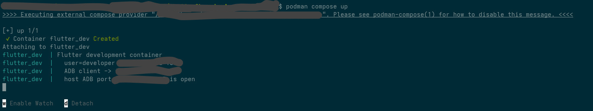
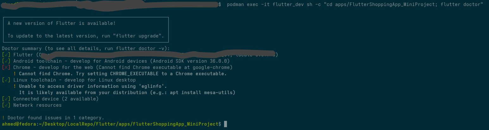
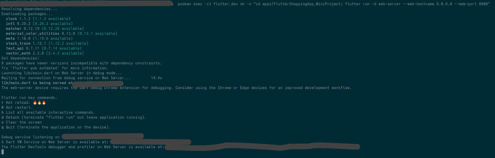
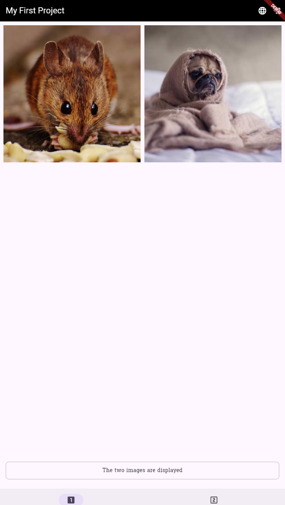
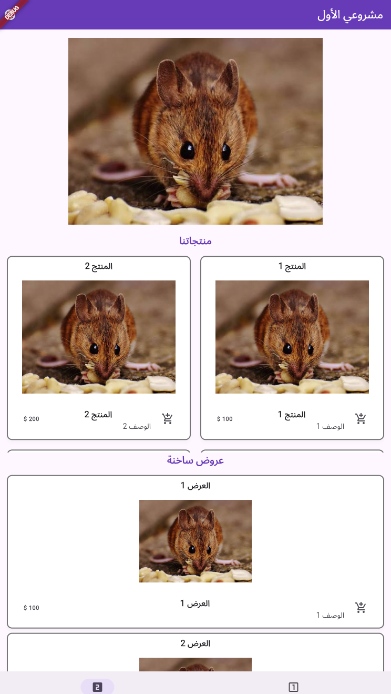
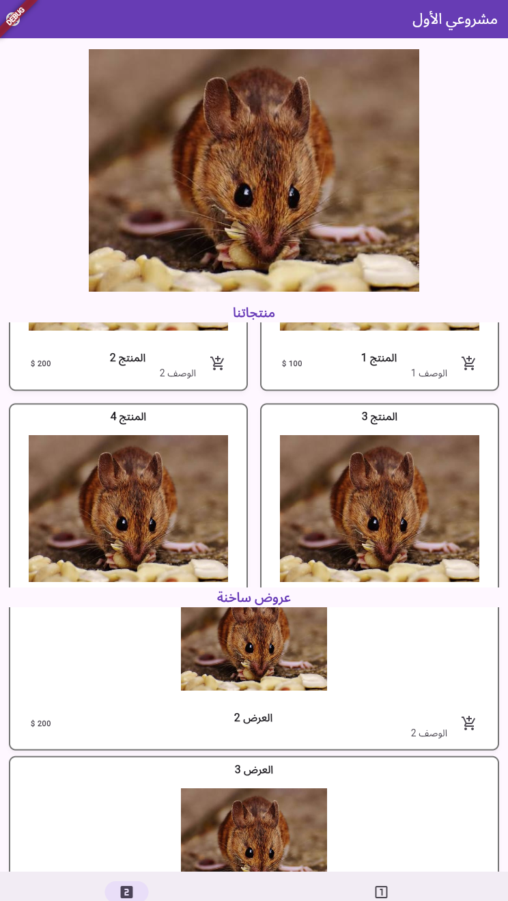
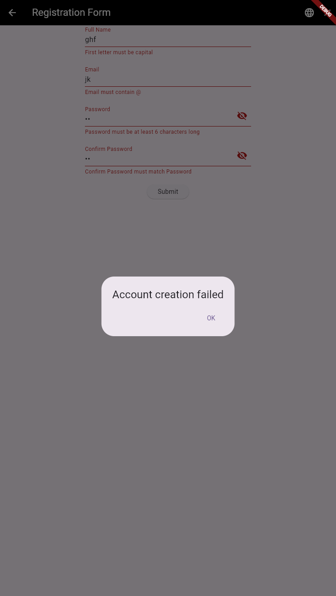

# Flutter Shopping App Mini Project

Flutter app with two bottom-nav phases: an image grid, and a products page with a page view, product cards, and hot offers. A registration form opens from Phase One. English and Arabic come from JSON files through `flutter_localization`.

---

## Requirements

- [Flutter SDK](https://docs.flutter.dev/get-started/install) (Dart `^3.12.2`)
- Git
- A device, emulator, or Chrome for `flutter run`

Check your setup:

```bash
flutter doctor
```




---

## Clone the project

```bash
git clone https://github.com/AhmedSobhyHamed/FlutterShoppingApp_MiniProject.git
cd FlutterShoppingApp_MiniProject
```

---

## Install packages

From the project root:

```bash
flutter pub get
```


This installs:

| Package | Role |
|---|---|
| `flutter_localization` | English / Arabic from JSON assets, `getString(context)`, and `translate()` |
| `cupertino_icons` | Icons |

---

## Run the project

```bash
flutter devices
flutter run
```



Pick a device if more than one is connected:

```bash
flutter run -d chrome
flutter run -d emulator-5554
```

Stop the app and run it again after changing `assets/i18n/` or `pubspec.yaml`. Hot reload does not pick up new assets.

---

## Tech stack

| Layer | Technology |
|---|---|
| UI | Flutter, Material 3 |
| Language | Dart 3.12+ |
| Navigation | Bottom bar — Phase One, Phase Two; registration is a pushed route |
| Images | `GridView.builder` and `PageView.builder`; local `Image.asset` or remote `Image.network` |
| Localization | `flutter_localization` — `assets/i18n/en.json`, `assets/i18n/ar.json` |
| Font | `Suwannaphum` for the English caption |
| Motion | `Hero` between the person icon, the Submit label, and **Our Products** |

---

## Project structure

```
lib/
├── main.dart                         # App entry: localization + MaterialApp + bottom nav
├── core/
│   └── scroll_page_view.dart         # Scroll behavior for the product page view
├── data/
│   ├── image_asset.dart              # Path + ImageType.local / ImageType.remote
│   └── card_asset.dart               # Product / offer name, description, price, images
├── l10n/
│   └── app_locale.dart               # JSON keys used with getString(context)
├── service/
│   ├── image_service.dart            # getImages, getProductImages, cards, offers
│   └── validators.dart               # Name, email, password, confirm password
└── view/
    ├── phase_one.dart                # Image grid + caption
    ├── phase_two.dart                # Product page view, cards, hot offers
    ├── phase_form.dart               # Registration app bar
    └── parts/
        ├── language_menu.dart        # English / Arabic menu
        ├── image_grid.dart           # GridView.builder
        ├── image_view.dart           # PageView.builder
        ├── caption_box.dart
        ├── form.dart                 # Registration fields and submit
        ├── text_dialog.dart
        ├── card_widget.dart
        ├── card_grid.dart
        └── card_view.dart

assets/
├── i18n/
│   ├── en.json
│   └── ar.json
├── fonts/
│   └── Suwannaphum-Regular.ttf
└── images/
    └── images.jpg
```

### How the layers fit

- **App entry** — `main` calls `FlutterLocalization.ensureInitialized()`, then loads `en.json` and `ar.json`. `MaterialApp` gets `locale`, `supportedLocales`, and `localizationsDelegates`. A language change calls `setState`, so every `getString(context)` rebuilds. Arabic uses right-to-left layout.
- **Home shell** — one bottom bar. Phase One and Phase Two each have their own `Scaffold`.
- **Phase One** — `ImageService.getImages()` feeds `ImageGrid`. A local file uses `Image.asset`; a URL uses `Image.network`. The caption sits under the grid. The person icon opens the registration form with a `Hero`.
- **Registration** — `LanguageMenu` is on this app bar too. Validators check the fields. Success replaces the form with Phase Two (`hero_dialog_success` flies to **Our Products**). Failure pops back to Phase One (`hero_dialog_failure` flies back to the person icon).
- **Phase Two** — a `PageView` of local product images, then product cards and hot offers. Card names and descriptions are JSON keys, so they change with the language. The cart button shows a `SnackBar`.
- **Language menu** — `lib/view/parts/language_menu.dart`, used on Phase One, Phase Two, and the registration page.

---

## Useful commands

```bash
flutter pub get          # install dependencies
flutter run              # run on a connected device
flutter test             # run tests
flutter analyze          # static analysis
```

---

## Screenshots

<!-- Files live in /.git_images — keep the names or update the paths. -->

### Phase One — image grid

Local and remote images, caption, and the language menu.



### Registration

Form, validation, and the result dialog.




### Phase Two — products

Page view, product cards, and hot offers. English and Arabic.



